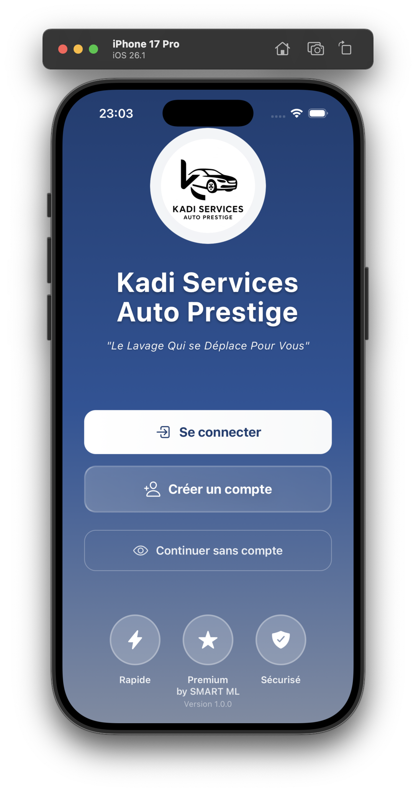

# 📸 Instructions pour les Images

Ce document indique où placer les différentes images nécessaires pour le site web.

## 📁 Structure des dossiers

```
Presentation/
├── images/
│   ├── logo-kadi.svg          ✅ (Déjà présent)
│   ├── logo-smartml.svg       ✅ (Déjà présent)
│   ├── hero-background.jpg    ⚠️ À AJOUTER
│   └── app-mockup.png         ⚠️ À AJOUTER
├── index.html
├── css/
│   └── style.css
└── js/
    └── main.js
```

---

## 🖼️ Images à ajouter

### 1. Images de Background Hero (CAROUSEL - 4 images)
**Fichiers :** 
- `images/hero-background-1.jpg`
- `images/hero-background-2.jpg`
- `images/hero-background-3.jpg`
- `images/hero-background-4.jpg`

**Description :** Images de fond pour la section hero avec carousel automatique (4 images qui changent toutes les 5 secondes)

**Caractéristiques recommandées :**
- Format : JPG ou PNG
- Dimensions : Minimum 1920x1080px (Full HD)
- Résolution : 72-150 DPI
- Taille du fichier : Optimisée (moins de 500 KB par image si possible)
- Sujet : Images liées aux services de lavage automobile (voiture, service, professionnel)
- Style : Moderne, professionnel, en noir et blanc ou tons sombres

**Exemples de sujets appropriés :**
- Voiture propre et brillante
- Service de lavage en action
- Équipement professionnel
- Garage/service professionnel
- Chauffeurs au travail
- Véhicules avant/après lavage

**Note :** Les images seront affichées en arrière-plan avec une opacité de 0.4 et un overlay sombre pour garantir la lisibilité du texte. Le carousel change automatiquement toutes les 5 secondes.

---

### 2. Image Mockup de l'Application
**Fichier :** `images/app-mockup.png`

**Description :** Capture d'écran ou mockup de l'application mobile

**Caractéristiques recommandées :**
- Format : PNG (avec transparence de préférence) ou JPG
- Dimensions : Minimum 600px de largeur (hauteur proportionnelle)
- Résolution : 72-150 DPI
- Taille du fichier : Optimisée (moins de 300 KB si possible)
- Style : 
  - Capture d'écran réelle de l'application mobile
  - OU Mockup professionnel (téléphone avec l'app à l'intérieur)
  - Fond transparent ou uni
  - Haute qualité, nette et claire

**Exemples :**
- Capture d'écran de l'écran d'accueil de l'app
- Mockup iPhone/Android avec l'app affichée
- Plusieurs captures d'écran montées ensemble (écran principal)

**Note :** L'image sera animée avec un effet de flottement et sera affichée dans la section hero à droite du texte.

---

## 📍 Emplacement des images dans le code

### Hero Background (Carousel)
Les fichiers sont référencés dans `index.html` avec un carousel Bootstrap :
```html
<div class="hero-background" style="background-image: url('images/hero-background-1.jpg');"></div>
<div class="hero-background" style="background-image: url('images/hero-background-2.jpg');"></div>
<div class="hero-background" style="background-image: url('images/hero-background-3.jpg');"></div>
<div class="hero-background" style="background-image: url('images/hero-background-4.jpg');"></div>
```

### App Mockup
Le fichier est référencé dans `index.html` :
```html

```

---

## 🎨 Logos (Format flexible : PNG, JPG ou SVG)

### Logo Kadi Services
**Fichiers acceptés :**
- `images/logo-kadi.png` (priorité 1)
- `images/logo-kadi.jpg` (priorité 2)
- `images/logo-kadi.svg` (fallback)

**Utilisé dans :**
- Navigation (en-tête)
- Footer

**Note :** Le site essaie d'abord le PNG, puis le JPG, puis le SVG en fallback automatique.

### Logo Smart ML
**Fichiers acceptés :**
- `images/logo-smartml.png` (priorité 1)
- `images/logo-smartml.jpg` (priorité 2)
- `images/logo-smartml.svg` (fallback)

**Utilisé dans :**
- Footer (section développeur)

**Note :** Le site essaie d'abord le PNG, puis le JPG, puis le SVG en fallback automatique.

---

## ✅ Checklist

Avant de mettre le site en ligne, vérifiez que :

- [ ] `images/hero-background-1.jpg` est présent
- [ ] `images/hero-background-2.jpg` est présent
- [ ] `images/hero-background-3.jpg` est présent
- [ ] `images/hero-background-4.jpg` est présent
- [ ] `images/app-mockup.png` est présent
- [ ] `images/logo-kadi.png` (ou .jpg/.svg) est présent
- [ ] `images/logo-smartml.png` (ou .jpg/.svg) est présent
- [ ] Les images sont optimisées pour le web (taille raisonnable)
- [ ] Les images s'affichent correctement dans le navigateur
- [ ] Le carousel hero fonctionne (images changent automatiquement)
- [ ] Le background hero est visible mais n'interfère pas avec la lisibilité
- [ ] L'image de l'app est nette et professionnelle
- [ ] Le site est responsive sur mobile (testez sur téléphone)

---

## 🔗 Liens App Store / Play Store

Les liens sont déjà configurés dans `index.html` :

**App Store :**
```html
href="https://apps.apple.com/app/kadi-services-auto-prestige/id[ID_APP]"
```
⚠️ **Remplacez `[ID_APP]` par l'ID réel de votre application sur l'App Store**

**Google Play :**
```html
href="https://play.google.com/store/apps/details?id=com.kadiautoprestige.client"
```
✅ Déjà configuré avec le package ID correct

---

## 📝 Notes importantes

1. **Noms de fichiers :** Respectez exactement les noms de fichiers indiqués (casse sensible sur certains serveurs)
2. **Format :** Utilisez les formats recommandés pour de meilleures performances
3. **Optimisation :** Compressez vos images avant de les ajouter pour améliorer les temps de chargement
4. **Sauvegarde :** Gardez toujours une copie de vos images originales

---

## 🛠️ Outils recommandés pour optimiser les images

- **TinyPNG** : https://tinypng.com/ (compression)
- **Squoosh** : https://squoosh.app/ (compression et conversion)
- **Canva** : https://www.canva.com/ (création de mockups)
- **Figma** : https://www.figma.com/ (création de mockups)

---

**Date de création :** 2025
**Dernière mise à jour :** 2025

